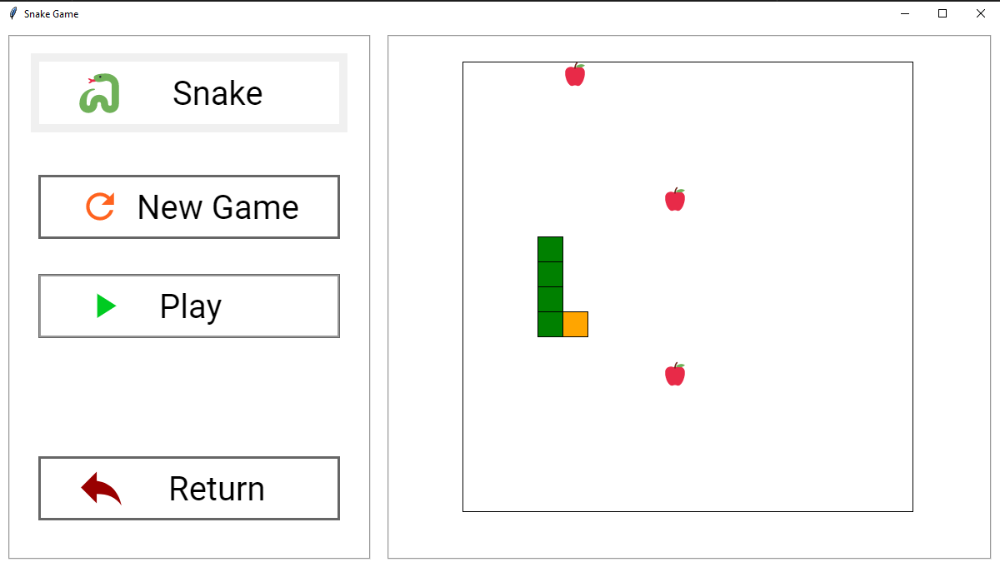

# SnakeGame
## Overview
Aplikacja umożliwia rozgrywke w popularnego węża, oraz wgląd w statystyki gier. 

## Description 
Gra polega na kontrolowaniu kierunku ruchu węża za pomocą klawiszy strzałek (góra, dół, lewo, prawo) lub WSAD.  
Maksymalny rozmiar to 3 (początkowy rozmiar węża to 1 ), zwiększa się on o 1 po zjedzeniu owocu.  
Owoce pojawiają się na losowych polach z stałą częstotliwością.  
Gra kończy się jeśli przy głowie węża nie ma już wolnych pól lub wąż ugryzie się w ogon.  
W momencie zakończenia gry gracz otrzymuje informacje o zdobytym wyniku a statystyki umieszczane są w bazie danych.  
Użytkownik ma dostęp do statystyk poprzez ekran Stats. Dane przedstawione są w formie tabeli.  

## Tools
* Python 3.6
* TkInter
* Sqlite3
* PandasTable 0.22
* Pillow 7.0

## How to run
* Windows
* run SnakeGame.exe

## Future improvements
* Optymalizacja wyświetlania
* Dodanie wprowadzania nazwy gracza
* Dodanie mechaniki obsługującej bomby (przeciwieństwo owoców)
* Dodanie przechodzenia przez ściany (obecnie waz zatrzymuje się na ścianie)
* Refaktoryzacja kodu (usunięcie redundancji)

## Author
**Michał Popiel** - [ReQezeR](https://github.com/ReQezeR)

## License
[MIT](https://choosealicense.com/licenses/mit/)
